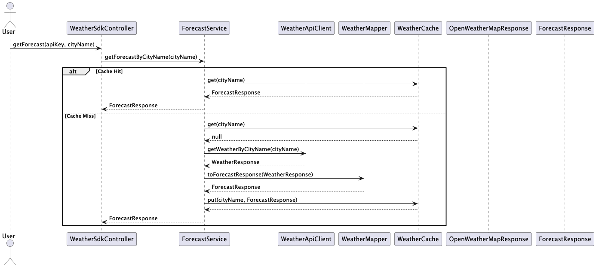

# Weather API Application

## Overview
This Weather API Application provides weather forecasts for cities using data from the OpenWeatherMap API. The application is built with Spring Boot and offers a RESTful interface for interacting with weather data.

## Getting Started

### Prerequisites
- Docker
- Docker Compose
- An active OpenWeatherMap API key (to be provided as a parameter)

### Running the Application
To run the application, navigate to the root directory of the project and execute the following command:
```bash
docker-compose up
```

### Accessing Swagger Documentation
Once the application is running, you can access the Swagger API documentation at:
```
http://localhost:8084/api-docs
```

To view the interactive API documentation UI, visit:
```
http://localhost:8084/swagger-ui/index.html
```

### Endpoints
- **Create SDK**: `POST /sdk/{apiKey}/{mode}`
- **Get Forecast**: `GET /sdk/{apiKey}/forecast/{cityName}`
- **Delete SDK**: `DELETE /sdk/{apiKey}`

## Flow
The application operates as follows:

1. **Create SDK**:
    - The user sends a `POST` request to the `/sdk/{apiKey}/{mode}` endpoint to create a new SDK instance. This initializes the SDK with the provided API key and mode.

2. **Get Forecast**:
    - To retrieve weather information, the user sends a `GET` request to the `/sdk/{apiKey}/forecast/{cityName}` endpoint, specifying the city name. The application fetches the forecast data and returns it to the user.

3. **Delete SDK**:
    - When the user no longer needs the SDK, they can send a `DELETE` request to the `/sdk/{apiKey}` endpoint to remove the SDK instance.

## Sequence Diagram

Below is the sequence diagram for the SDK interactions.



## Testing
Unit and integration tests are located in the `test/java` directory. You can run the tests using:
```bash
mvn test
```

## License
This project is licensed under the MIT License. See the LICENSE file for details.

## Acknowledgements
- [OpenWeatherMap API] for weather data.
- [Spring Boot] for building the application.